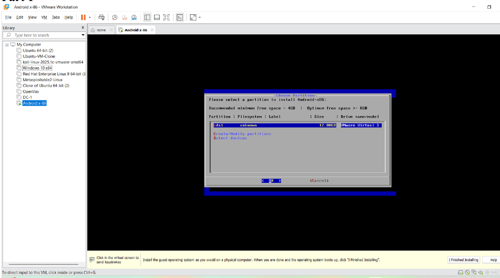
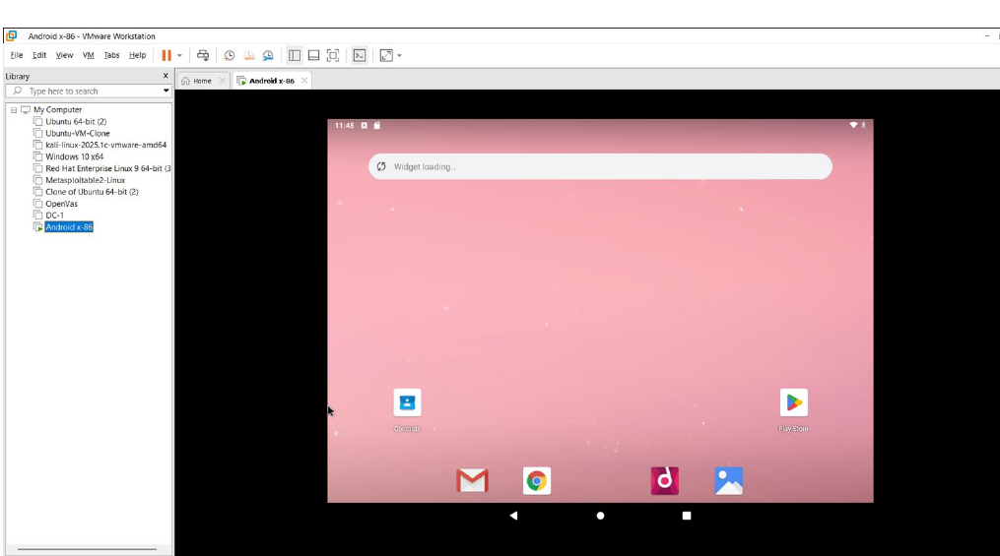
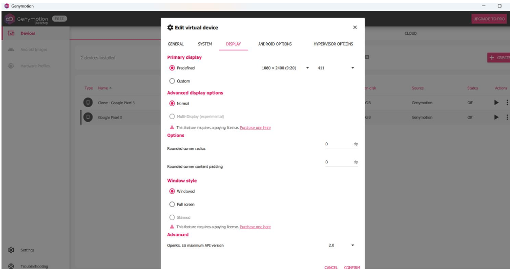
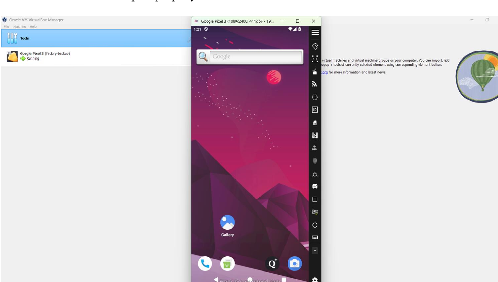
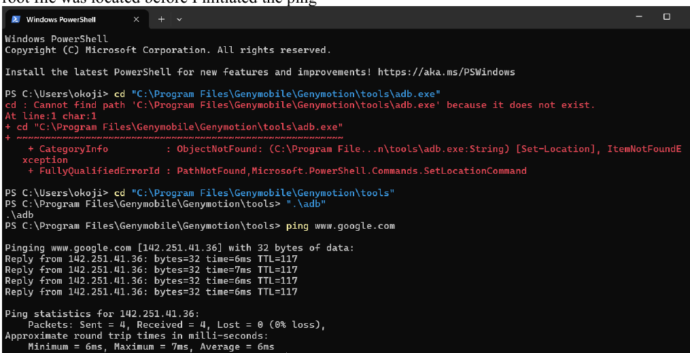
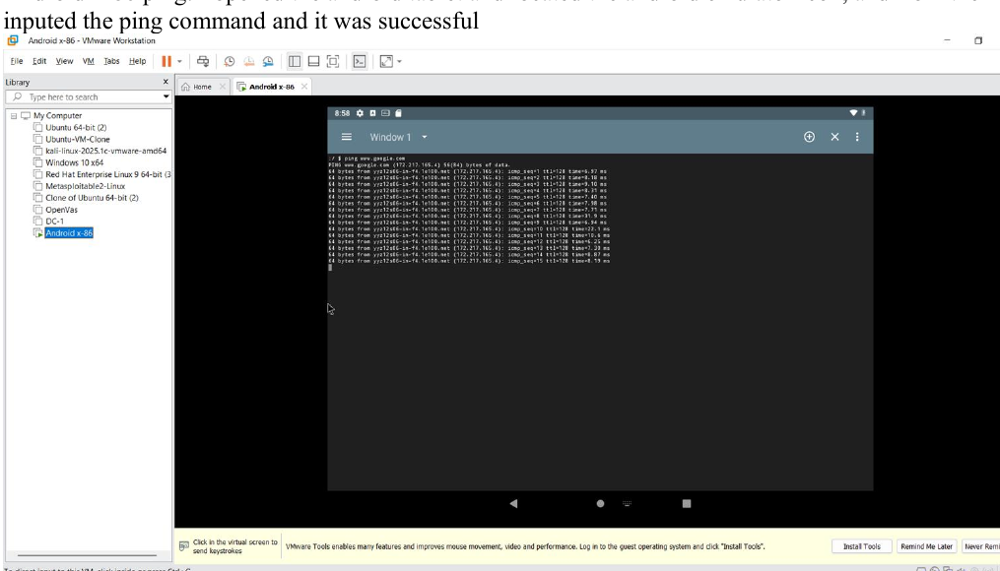

# Android Mobile Security Testing Environment

## Overview

This project documents the setup and configuration of a mobile security testing environment using **Android-x86, VMware, Genymotion, and Android Studio**.

The objective was to create functional Android virtual environments that could later be used for mobile application security testing and traffic analysis.

## Tools and Technologies

* Android-x86
* VMware
* Genymotion
* Windows PowerShell
* Android Studio
* Android Emulator

## Project Objectives

* Install and configure Android-x86 in a virtual environment
* Set up and configure Genymotion
* Verify network connectivity between the Android environments and the host system
* Compare the usability and performance of different Android emulators
* Locate and explore the Android Manifest file within Android Studio

## Implementation

### 1. Android-x86 Setup

Android-x86 was installed within VMware. During the installation process, a partition was created to host the Android virtual environment.
#### Android-x86 Installation

*Android-x86 installation process showing the virtual environment setup and partition configuration.*
After installation, Android-x86 was successfully deployed and made available for testing.
#### Android-x86 Deployment

*Successfully deployed Android-x86 virtual environment in VMware.*
### 2. Genymotion Configuration

Genymotion was installed and configured as an additional Android virtualization environment.

#### Genymotion Setup

*Genymotion installation and configuration process used to prepare the Android virtual environment.*

The emulator settings were adjusted during installation, and the Android interface was successfully launched after configuration.

#### Genymotion Android Environment

*Successfully configured and running Genymotion Android virtual environment.*
### 3. Network Connectivity Testing

Connectivity testing was performed to verify that both Android virtual environments were properly configured and capable of network communication.

#### Genymotion Connectivity Test

*Network connectivity test performed for the Genymotion environment using Windows PowerShell.*

The successful test confirmed that the Genymotion virtual environment was functioning and accessible.

#### Android-x86 Connectivity Test

*Connectivity testing performed within the Android-x86 environment.*

The successful ping test confirmed that the Android-x86 environment had working network connectivity.
### 4. Emulator Comparison

After working with both Genymotion and Android-x86, I compared their usability and performance.

Android-x86 required more effort during the initial installation process, but once configured, it provided a responsive interface and a smooth user experience.
### 5. Android Manifest Exploration

Android Studio was used to locate the application's Android Manifest file.

The manifest is an important component of Android applications because it contains information about application configuration, permissions, components, and other security-relevant settings.

## Skills Demonstrated

* Mobile Security Lab Configuration
* Android Virtualization
* VMware Configuration
* Android-x86 Deployment
* Genymotion Configuration
* Network Connectivity Testing
* Windows PowerShell
* Android Studio
* Mobile Application Environment Analysis
* Technical Troubleshooting

## Key Takeaway

This project provided hands-on experience in building and validating an Android mobile security testing environment. The configured environment created the foundation for further mobile application security exercises, including proxy configuration, HTTP/HTTPS traffic interception, and security analysis using tools such as Burp Suite.
